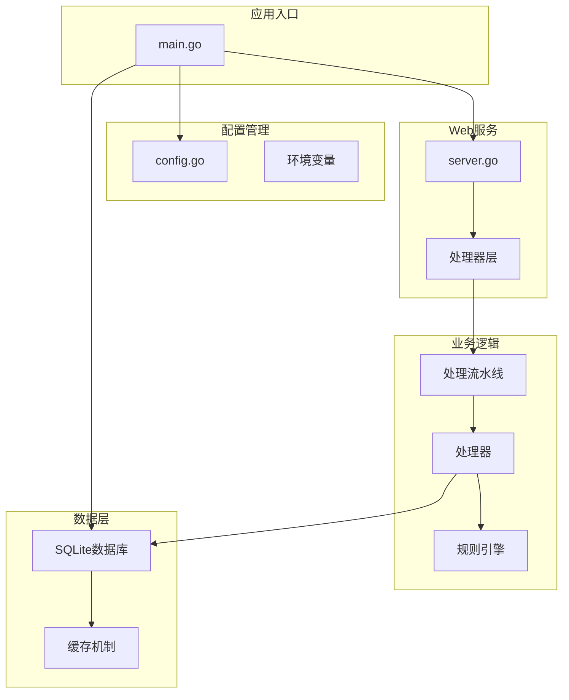
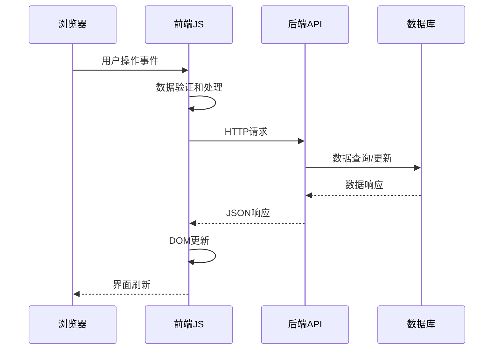
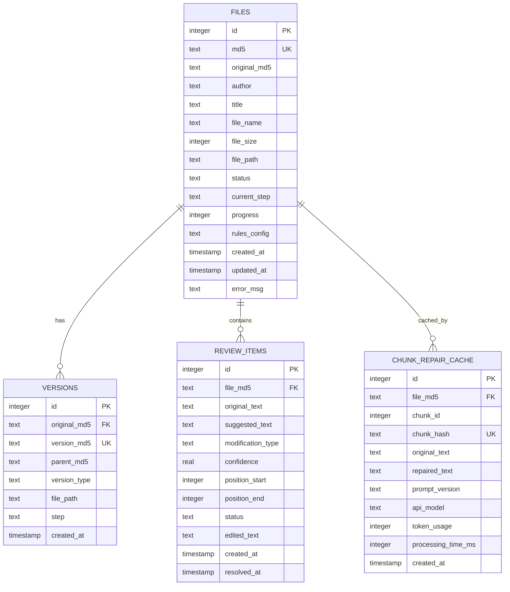
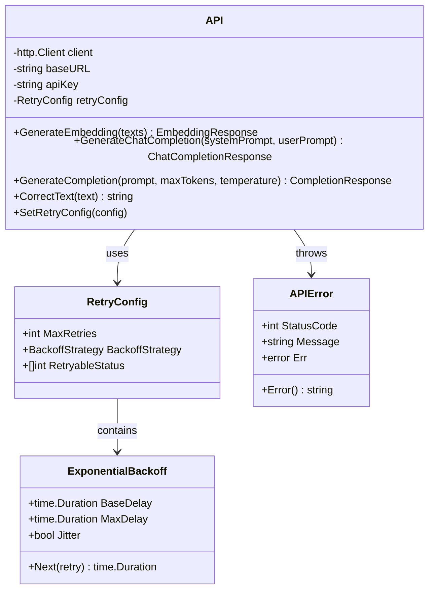
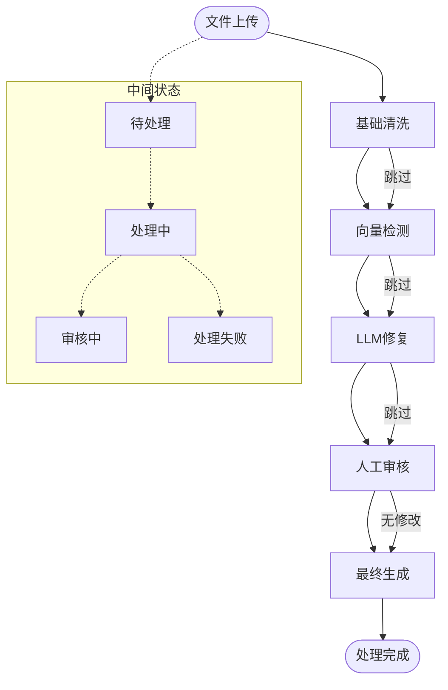

# 技术栈概览

<cite>
**本文档引用的文件**
- [go.mod](file://go.mod)
- [main.go](file://cmd/txtclean/main.go)
- [config.go](file://internal/config/config.go)
- [server.go](file://web/backend/server.go)
- [db.go](file://internal/database/db.go)
- [api.go](file://internal/external/api.go)
- [index.html](file://web/frontend/index.html)
- [main.js](file://web/frontend/static/js/main.js)
- [style.css](file://web/frontend/static/css/style.css)
- [pipeline.go](file://internal/processor/pipeline.go)
- [nlp.go](file://internal/processor/model/nlp.go)
- [model_repairer.go](file://internal/processor/model_repairer.go)
- [vector_detector.go](file://internal/processor/vector_detector.go)
- [preprocess.go](file://internal/processor/preprocess/preprocess.go)
- [postprocess.go](file://internal/processor/postprocess/postprocess.go)
- [rules.go](file://internal/processor/rules/rules.go)
</cite>

## 目录
1. [项目概述](#项目概述)
2. [后端技术栈](#后端技术栈)
3. [前端技术栈](#前端技术栈)
4. [数据库与存储](#数据库与存储)
5. [外部依赖与集成](#外部依赖与集成)
6. [架构设计与数据流](#架构设计与数据流)
7. [技术选型考量](#技术选型考量)
8. [性能与可维护性](#性能与可维护性)
9. [总结](#总结)

## 项目概述

txtCleaning是一个基于Go语言开发的小说文本清洗与修复系统，提供从基础清洗、向量检测、LLM修复到人工审核的完整处理流水线。系统采用前后端分离架构，后端提供RESTful API，前端使用原生HTML5、CSS3和JavaScript构建交互式用户界面。

## 后端技术栈

### Go语言核心优势

**高性能并发处理**
- 基于Go 1.25.0标准，充分利用goroutine实现高并发处理
- 内置的内存管理和垃圾回收机制确保长期运行稳定性
- 优秀的标准库支持网络编程和并发控制

**模块化架构设计**
- 采用清晰的包结构组织代码，便于维护和扩展
- 内部模块职责明确，包括配置管理、数据库操作、处理器等
- 支持插件化扩展，便于集成新的处理算法

### Web框架选择：Gin

**轻量级高性能**
- Gin框架提供约10倍于传统框架的性能表现
- 中间件机制支持CORS、日志、认证等通用功能
- 路由设计简洁直观，符合RESTful API规范

**开发效率提升**
- 自动参数绑定和验证机制
- 丰富的HTTP状态码和响应处理
- 良好的错误处理和调试支持

### 核心后端组件

**图表来源**
- [main.go:18-61](file://cmd/txtclean/main.go#L18-L61)
- [config.go:48-122](file://internal/config/config.go#L48-L122)
- [server.go:10-57](file://web/backend/server.go#L10-L57)

**章节来源**
- [go.mod:1-54](file://go.mod#L1-L54)
- [main.go:1-61](file://cmd/txtclean/main.go#L1-L61)
- [server.go:1-58](file://web/backend/server.go#L1-L58)

## 前端技术栈

### HTML5与CSS3现代化实践

**语义化HTML结构**
- 使用HTML5语义标签构建清晰的页面结构
- 支持现代浏览器特性，提供良好的用户体验
- 响应式设计适配不同设备屏幕尺寸

**现代化CSS3样式**
- 使用CSS Grid和Flexbox布局实现复杂页面结构
- CSS变量支持主题定制和动态样式切换
- 动画和过渡效果提升用户交互体验
- 深色模式支持和无障碍访问优化

### JavaScript原生开发

**模块化JavaScript架构**
- 原生JavaScript实现，无第三方框架依赖
- 采用ES6+语法特性，提升代码可读性和维护性
- Promise和async/await处理异步操作
- DOM操作优化，减少重绘和回流

**交互式用户界面**
- 实时文件上传和进度监控
- 动态内容加载和更新
- 审核界面的实时状态同步
- 用户友好的错误提示和反馈机制

**图表来源**
- [main.js:96-132](file://web/frontend/static/js/main.js#L96-L132)
- [main.js:219-288](file://web/frontend/static/js/main.js#L219-L288)

**章节来源**
- [index.html:1-230](file://web/frontend/index.html#L1-L230)
- [main.js:1-791](file://web/frontend/static/js/main.js#L1-L791)
- [style.css:1-897](file://web/frontend/static/css/style.css#L1-L897)

## 数据库与存储

### SQLite数据库设计

**嵌入式数据库优势**
- 无需独立数据库服务器，部署简单
- 单文件数据库，便于备份和迁移
- 支持ACID事务，保证数据一致性
- 良好的跨平台兼容性

**优化的数据库配置**
- 启用WAL模式提高并发性能
- 配置合理的缓存大小和连接池
- 索引优化支持高频查询场景
- 自动检查点机制确保数据安全

### 数据库表结构设计

**图表来源**
- [db.go:89-222](file://internal/database/db.go#L89-L222)

**章节来源**
- [db.go:1-223](file://internal/database/db.go#L1-L223)

## 外部依赖与集成

### LLM模型API集成

**智能分块与并发处理**
- 文本智能分块算法，每块1500-2000字符
- 工作池并发处理，支持10个并发worker
- 缓存机制确保幂等性和性能优化
- 断点续传支持，提升用户体验

**动态提示词管理**
- 提示词版本控制系统
- 自适应优化机制
- 使用统计和效果监控
- 支持热重载和动态更新

### 外部API客户端设计

**图表来源**
- [api.go:175-200](file://internal/external/api.go#L175-L200)
- [api.go:97-116](file://internal/external/api.go#L97-L116)
- [api.go:61-95](file://internal/external/api.go#L61-L95)

**章节来源**
- [api.go:1-738](file://internal/external/api.go#L1-L738)

### 环境变量管理

**配置系统设计**
- 支持多种配置源：.env文件、环境变量、命令行参数
- 类型安全的配置解析和验证
- 默认值管理和运行时配置更新
- 配置热重载支持

**安全配置实践**
- API密钥和敏感信息的安全存储
- 配置验证和错误处理
- 日志脱敏和审计跟踪
- 配置文件权限控制

## 架构设计与数据流

### 处理流水线架构

**五阶段处理流程**
1. **基础清洗**：编码规范化、广告清理、特殊字符处理
2. **向量检测**：重复内容检测和去重
3. **LLM修复**：智能分块并发修复
4. **人工审核**：修改建议审核和确认
5. **最终生成**：生成最终清理后的文件

**图表来源**
- [pipeline.go:19-25](file://internal/processor/pipeline.go#L19-L25)
- [pipeline.go:104-158](file://internal/processor/pipeline.go#L104-L158)

### 数据处理管道

**预处理阶段**
- 编码规范化和修复
- 广告内容识别和移除
- 特殊字符清理
- 空白字符标准化

**核心处理阶段**
- 文本预处理和格式优化
- 规则引擎应用
- 向量相似度计算
- LLM智能修复

**后处理阶段**
- 文本格式优化
- 章节结构整理
- 标点符号规范化
- 最终内容质量检查

**章节来源**
- [preprocess.go:29-50](file://internal/processor/preprocess/preprocess.go#L29-L50)
- [pipeline.go:160-213](file://internal/processor/pipeline.go#L160-L213)
- [postprocess.go:24-43](file://internal/processor/postprocess/postprocess.go#L24-L43)

## 技术选型考量

### 性能优化策略

**并发处理优化**
- Go语言goroutine实现高并发
- SQLite WAL模式提升并发性能
- 工作池并发处理减少API调用延迟
- 缓存机制避免重复计算

**内存管理优化**
- 对象池减少GC压力
- 流式处理避免大对象内存占用
- 及时释放数据库连接
- 合理的缓冲区大小控制

**网络通信优化**
- HTTP客户端连接池复用
- 指数退避重试机制
- 超时控制和错误恢复
- CDN和静态资源优化

### 可维护性设计

**代码组织原则**
- 单一职责原则，模块边界清晰
- 依赖注入降低耦合度
- 接口抽象支持测试和扩展
- 错误处理和日志记录完善

**架构设计原则**
- 分层架构便于理解和维护
- 插件化设计支持功能扩展
- 配置驱动减少硬编码
- 版本控制和向后兼容

### 开发效率提升

**开发工具链**
- Go Modules依赖管理
- 单元测试和集成测试
- 代码格式化和静态分析
- CI/CD自动化部署

**运维友好性**
- Docker容器化支持
- 健康检查和监控集成
- 日志聚合和分析
- 自动备份和恢复机制

## 性能与可维护性

### 性能监控指标

**系统性能指标**
- API响应时间：< 100ms（静态资源）
- 数据库查询性能：支持高并发读写
- LLM API调用：并发控制和限流
- 内存使用：持续监控和优化

**处理性能优化**
- 智能分块算法提升LLM处理效率
- 缓存命中率：目标>80%
- 并发处理吞吐量：支持多文件同时处理
- 存储空间优化：增量备份和压缩

### 可维护性保障

**代码质量保证**
- 代码审查和最佳实践
- 单元测试覆盖率：>80%
- 集成测试和端到端测试
- 性能回归测试

**系统稳定性**
- 异常处理和错误恢复
- 优雅关闭和资源清理
- 监控告警和故障诊断
- 备份恢复和灾难恢复

## 总结

txtCleaning项目采用现代化的技术栈组合，实现了高性能、可维护、易扩展的小说文本清洗系统。后端基于Go语言和Gin框架，提供了稳定可靠的处理能力；前端使用原生HTML5、CSS3和JavaScript，构建了用户友好的交互界面；SQLite数据库确保了数据的一致性和可靠性；LLM API集成提供了智能化的文本修复能力。

技术选型充分考虑了性能、可维护性和开发效率的平衡，通过合理的架构设计和优化策略，系统能够满足生产环境的高并发和高可用需求。模块化的代码结构和完善的测试体系为未来的功能扩展和维护提供了坚实的基础。