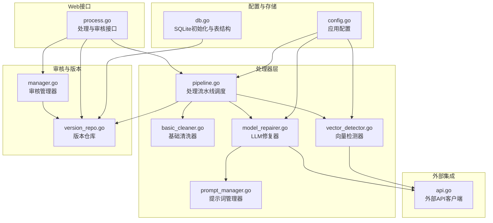
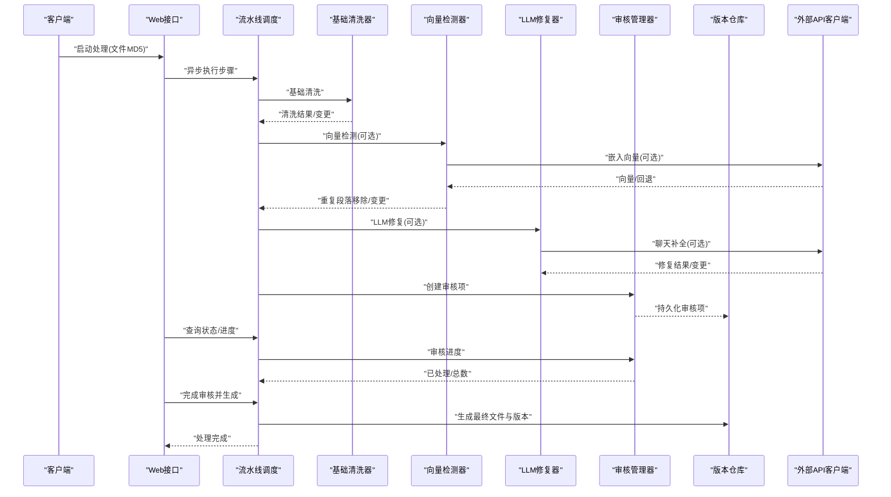
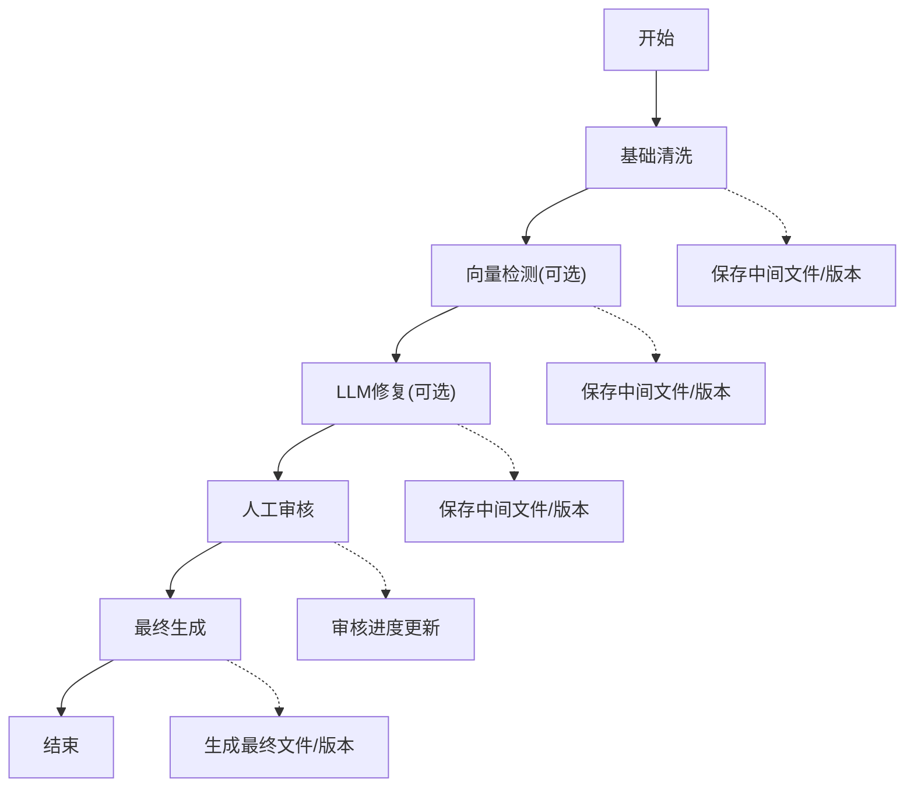
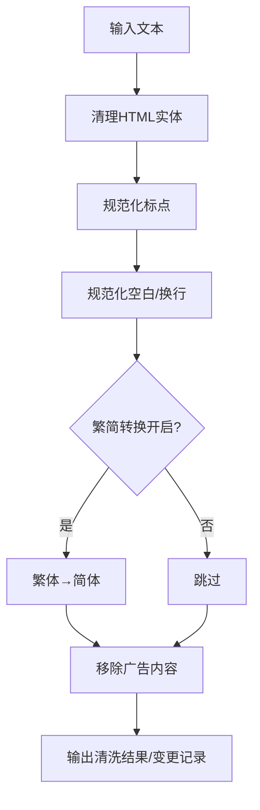
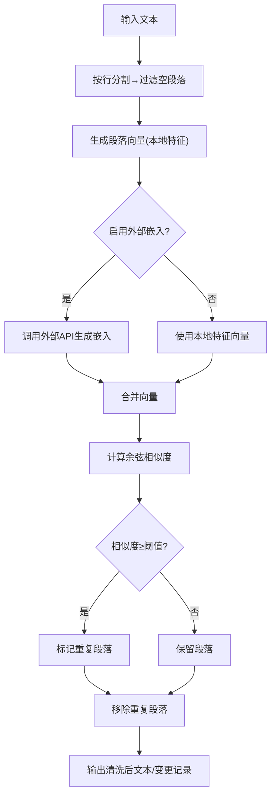
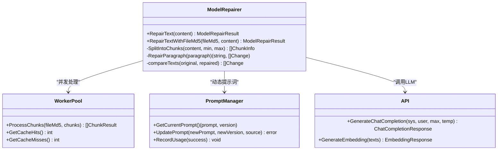
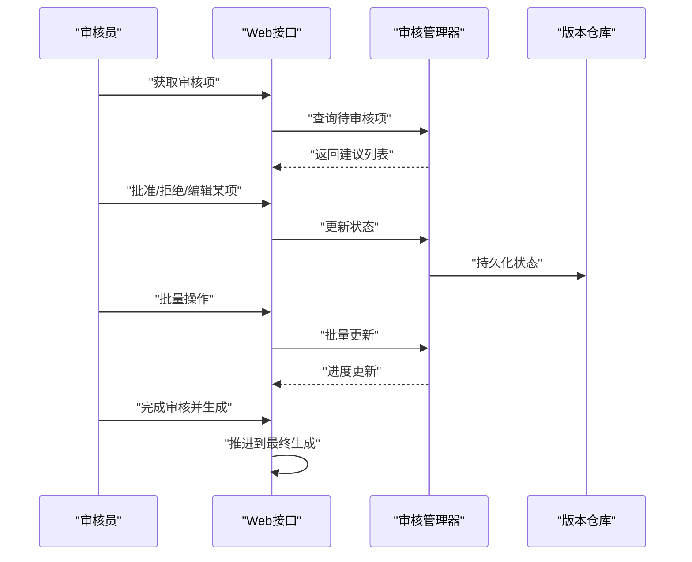
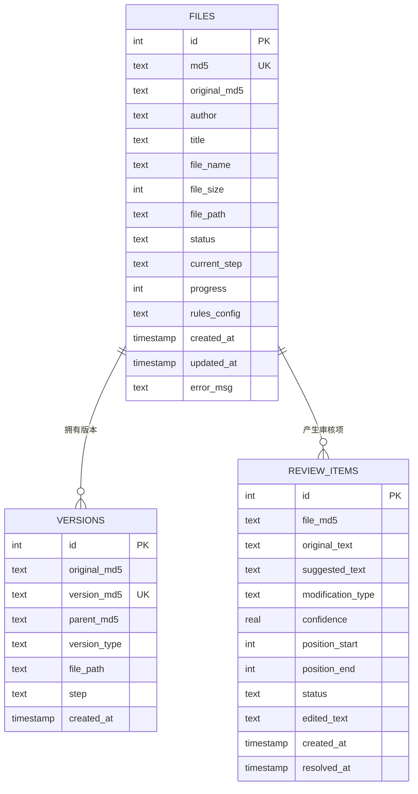
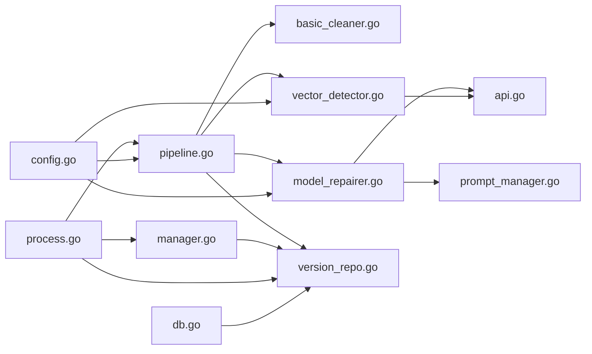

# 核心功能特性

<cite>
**本文引用的文件**
- [pipeline.go](file://internal/processor/pipeline.go)
- [basic_cleaner.go](file://internal/processor/basic_cleaner.go)
- [vector_detector.go](file://internal/processor/vector_detector.go)
- [model_repairer.go](file://internal/processor/model_repairer.go)
- [prompt_manager.go](file://internal/processor/prompt_manager.go)
- [manager.go](file://internal/review/manager/manager.go)
- [version_repo.go](file://internal/database/version_repo.go)
- [api.go](file://internal/external/api.go)
- [config.go](file://internal/config/config.go)
- [db.go](file://internal/database/db.go)
- [process.go](file://web/backend/handlers/process.go)
</cite>

## 目录
1. [简介](#简介)
2. [项目结构](#项目结构)
3. [核心组件](#核心组件)
4. [架构总览](#架构总览)
5. [详细组件分析](#详细组件分析)
6. [依赖关系分析](#依赖关系分析)
7. [性能考量](#性能考量)
8. [故障排查指南](#故障排查指南)
9. [结论](#结论)
10. [附录](#附录)

## 简介
本文件面向txtCleaning项目的核心功能特性，围绕文本处理流水线的五大步骤进行深入说明：基础清洗、向量检测、LLM修复、人工审核、最终生成。文档还详细解释向量相似度检测的工作原理与算法实现，介绍LLM智能修复功能（支持的模型类型、API集成方式与修复效果评估），阐述人工审核机制的设计思路与工作流程，并说明版本管理系统如何追踪处理历史与管理文件版本。最后提供每个功能的实际应用场景与使用案例，帮助用户理解各功能的价值与适用场景。

## 项目结构
项目采用分层与模块化组织，核心处理逻辑集中在internal/processor，数据库与版本管理位于internal/database，外部API适配在internal/external，Web后端接口在web/backend，配置与运行参数在internal/config。

图表来源
- [pipeline.go:1-610](file://internal/processor/pipeline.go#L1-L610)
- [basic_cleaner.go:1-280](file://internal/processor/basic_cleaner.go#L1-L280)
- [vector_detector.go:1-224](file://internal/processor/vector_detector.go#L1-L224)
- [model_repairer.go:1-731](file://internal/processor/model_repairer.go#L1-L731)
- [prompt_manager.go:1-363](file://internal/processor/prompt_manager.go#L1-L363)
- [manager.go:1-234](file://internal/review/manager/manager.go#L1-L234)
- [version_repo.go:1-115](file://internal/database/version_repo.go#L1-L115)
- [api.go:1-738](file://internal/external/api.go#L1-L738)
- [config.go:1-204](file://internal/config/config.go#L1-L204)
- [db.go:1-223](file://internal/database/db.go#L1-L223)
- [process.go:1-511](file://web/backend/handlers/process.go#L1-L511)

章节来源
- [pipeline.go:1-610](file://internal/processor/pipeline.go#L1-L610)
- [config.go:1-204](file://internal/config/config.go#L1-L204)

## 核心组件
- 文本处理流水线：负责按序执行基础清洗、向量检测、LLM修复、人工审核、最终生成，并维护进度与状态。
- 基础清洗器：执行HTML实体清理、标点规范化、空白字符处理、繁简转换、广告内容移除等。
- 向量检测器：基于段落级相似度检测重复内容，支持本地特征与外部API嵌入向量。
- LLM修复器：集成智能分块、Worker Pool并发、缓存幂等性与断点续传，支持API与本地修复回退。
- 提示词管理器：动态加载/热更新提示词，记录使用统计，支持Evolver自进化。
- 审核管理器：管理审核会话、状态流转、持久化与进度计算。
- 版本仓库：维护文件版本链、中间产物与最终产物，支持追溯与生成。
- 外部API客户端：统一HTTP客户端、指数退避重试、错误分类与日志记录。
- Web接口：提供异步处理、状态查询、审核项管理与最终生成接口。

章节来源
- [pipeline.go:19-158](file://internal/processor/pipeline.go#L19-L158)
- [basic_cleaner.go:19-51](file://internal/processor/basic_cleaner.go#L19-L51)
- [vector_detector.go:12-69](file://internal/processor/vector_detector.go#L12-L69)
- [model_repairer.go:19-75](file://internal/processor/model_repairer.go#L19-L75)
- [prompt_manager.go:15-76](file://internal/processor/prompt_manager.go#L15-L76)
- [manager.go:44-54](file://internal/review/manager/manager.go#L44-L54)
- [version_repo.go:8-33](file://internal/database/version_repo.go#L8-L33)
- [api.go:175-200](file://internal/external/api.go#L175-L200)
- [process.go:15-77](file://web/backend/handlers/process.go#L15-L77)

## 架构总览
文本处理流水线以“步骤”为单位推进，每个步骤对应独立的处理器组件，通过统一的调度器协调状态、进度与中间产物保存。审核阶段引入人工参与，最终生成阶段汇总所有变更并产出最终文件与版本记录。

图表来源
- [process.go:15-77](file://web/backend/handlers/process.go#L15-L77)
- [pipeline.go:104-158](file://internal/processor/pipeline.go#L104-L158)
- [basic_cleaner.go:32-51](file://internal/processor/basic_cleaner.go#L32-L51)
- [vector_detector.go:36-69](file://internal/processor/vector_detector.go#L36-L69)
- [model_repairer.go:77-122](file://internal/processor/model_repairer.go#L77-L122)
- [manager.go:56-89](file://internal/review/manager/manager.go#L56-L89)
- [version_repo.go:20-33](file://internal/database/version_repo.go#L20-L33)
- [api.go:579-667](file://internal/external/api.go#L579-L667)

## 详细组件分析

### 文本处理流水线（五大步骤）
- 步骤定义与顺序：基础清洗、向量检测、LLM修复、人工审核、最终生成。
- 进度计算：每个步骤按固定权重分配进度，结合子步骤进度进行加权。
- 中间产物：每步结束后保存中间文件并创建版本记录，便于断点续传与回溯。
- 错误处理：捕获异常并记录处理日志，更新文件状态为失败，保留错误信息。

图表来源
- [pipeline.go:19-102](file://internal/processor/pipeline.go#L19-L102)
- [pipeline.go:160-213](file://internal/processor/pipeline.go#L160-L213)
- [pipeline.go:215-271](file://internal/processor/pipeline.go#L215-L271)
- [pipeline.go:273-376](file://internal/processor/pipeline.go#L273-L376)
- [pipeline.go:436-468](file://internal/processor/pipeline.go#L436-L468)
- [pipeline.go:470-522](file://internal/processor/pipeline.go#L470-L522)
- [pipeline.go:547-579](file://internal/processor/pipeline.go#L547-L579)

章节来源
- [pipeline.go:19-102](file://internal/processor/pipeline.go#L19-L102)
- [pipeline.go:160-213](file://internal/processor/pipeline.go#L160-L213)
- [pipeline.go:215-271](file://internal/processor/pipeline.go#L215-L271)
- [pipeline.go:273-376](file://internal/processor/pipeline.go#L273-L376)
- [pipeline.go:436-522](file://internal/processor/pipeline.go#L436-L522)
- [pipeline.go:547-579](file://internal/processor/pipeline.go#L547-L579)

### 基础清洗器
- 功能要点：
  - HTML实体清理与规范化标点（中文语境下半角→全角）。
  - 控制字符与多余空白处理，统一换行符。
  - 繁体转简体（可配置开关）。
  - 广告内容识别与移除（正则模式集合）。
- 变更记录：记录每次修改的类型、原文片段、替换内容与位置，便于审计与回溯。

图表来源
- [basic_cleaner.go:32-51](file://internal/processor/basic_cleaner.go#L32-L51)
- [basic_cleaner.go:53-78](file://internal/processor/basic_cleaner.go#L53-L78)
- [basic_cleaner.go:80-125](file://internal/processor/basic_cleaner.go#L80-L125)
- [basic_cleaner.go:159-190](file://internal/processor/basic_cleaner.go#L159-L190)
- [basic_cleaner.go:192-232](file://internal/processor/basic_cleaner.go#L192-L232)
- [basic_cleaner.go:234-270](file://internal/processor/basic_cleaner.go#L234-L270)

章节来源
- [basic_cleaner.go:11-51](file://internal/processor/basic_cleaner.go#L11-L51)
- [basic_cleaner.go:53-270](file://internal/processor/basic_cleaner.go#L53-L270)

### 向量相似度检测（算法与实现）
- 段落级处理：按换行分割文本，过滤空段落，生成段落向量。
- 特征与相似度：
  - 简化实现：使用段落长度、中文句号与逗号数量归一化作为特征向量。
  - 余弦相似度计算：用于衡量向量夹角，相似度阈值决定重复判定。
  - 外部API嵌入：当配置为API模式时，优先调用外部嵌入服务；失败或不可用时降级为本地特征。
- 重复检测与移除：对重复段落进行标记与移除，记录变更并保存中间结果。

图表来源
- [vector_detector.go:36-69](file://internal/processor/vector_detector.go#L36-L69)
- [vector_detector.go:71-86](file://internal/processor/vector_detector.go#L71-L86)
- [vector_detector.go:88-111](file://internal/processor/vector_detector.go#L88-L111)
- [vector_detector.go:177-198](file://internal/processor/vector_detector.go#L177-L198)
- [vector_detector.go:200-223](file://internal/processor/vector_detector.go#L200-L223)

章节来源
- [vector_detector.go:12-69](file://internal/processor/vector_detector.go#L12-L69)
- [vector_detector.go:88-111](file://internal/processor/vector_detector.go#L88-L111)
- [vector_detector.go:177-198](file://internal/processor/vector_detector.go#L177-L198)
- [vector_detector.go:200-223](file://internal/processor/vector_detector.go#L200-L223)

### LLM智能修复（模型类型、API集成与修复效果评估）
- 支持的模型类型与集成方式：
  - 模型类型：API（推荐）与本地（简化）。
  - API集成：统一HTTP客户端、指数退避重试、错误分类与日志记录；支持聊天补全与嵌入向量。
- 智能分块与并发：
  - 分块策略：按换行合并段落至1500-2000字符区间，保持段落完整性。
  - Worker Pool：并发处理所有块，支持缓存命中/未命中统计与断点续传。
- 缓存幂等性与回退：
  - 块级缓存：以段落哈希为键，命中直接返回修复结果。
  - 回退机制：API失败时本地修复，或记录重试队列供后续处理。
- 修复效果评估：
  - 统计指标：总块数、修改数、缓存命中/未命中次数。
  - 监控阈值：缓存命中率低、API错误率高时触发Evolver自进化监控。

图表来源
- [model_repairer.go:19-75](file://internal/processor/model_repairer.go#L19-L75)
- [model_repairer.go:124-211](file://internal/processor/model_repairer.go#L124-L211)
- [model_repairer.go:218-249](file://internal/processor/model_repairer.go#L218-L249)
- [model_repairer.go:526-563](file://internal/processor/model_repairer.go#L526-L563)
- [prompt_manager.go:15-76](file://internal/processor/prompt_manager.go#L15-L76)
- [api.go:579-667](file://internal/external/api.go#L579-L667)

章节来源
- [model_repairer.go:19-122](file://internal/processor/model_repairer.go#L19-L122)
- [model_repairer.go:124-211](file://internal/processor/model_repairer.go#L124-L211)
- [model_repairer.go:218-365](file://internal/processor/model_repairer.go#L218-L365)
- [model_repairer.go:526-731](file://internal/processor/model_repairer.go#L526-L731)
- [prompt_manager.go:15-76](file://internal/processor/prompt_manager.go#L15-L76)
- [api.go:175-200](file://internal/external/api.go#L175-L200)
- [api.go:293-418](file://internal/external/api.go#L293-L418)
- [api.go:579-667](file://internal/external/api.go#L579-L667)

### 人工审核机制（设计思路与工作流程）
- 设计思路：
  - 将LLM修复与基础清洗产生的变更项转化为审核项，交由人工确认。
  - 支持单条/批量审批、拒绝、手动编辑与恢复为待审核。
  - 审核进度与状态实时更新，支持HTML报告导出。
- 工作流程：
  - 生成审核项：将变更记录写入数据库，状态初始为“待审核”。
  - 审核操作：批准/拒绝/编辑/恢复，更新状态并持久化。
  - 完成推进：当所有审核项处理完毕，推进到最终生成步骤。

图表来源
- [manager.go:56-89](file://internal/review/manager/manager.go#L56-L89)
- [manager.go:111-142](file://internal/review/manager/manager.go#L111-L142)
- [manager.go:178-195](file://internal/review/manager/manager.go#L178-L195)
- [process.go:123-167](file://web/backend/handlers/process.go#L123-L167)
- [process.go:169-234](file://web/backend/handlers/process.go#L169-L234)
- [process.go:302-326](file://web/backend/handlers/process.go#L302-L326)

章节来源
- [manager.go:14-54](file://internal/review/manager/manager.go#L14-L54)
- [manager.go:56-142](file://internal/review/manager/manager.go#L56-L142)
- [manager.go:178-195](file://internal/review/manager/manager.go#L178-L195)
- [process.go:123-167](file://web/backend/handlers/process.go#L123-L167)
- [process.go:169-234](file://web/backend/handlers/process.go#L169-L234)
- [process.go:302-326](file://web/backend/handlers/process.go#L302-L326)

### 版本管理系统（处理历史与文件版本）
- 版本记录：包含原始MD5、版本MD5、父版本MD5、版本类型（中间/最终）、文件路径与步骤。
- 追溯能力：通过版本链可追溯到原始文件，支持按原始MD5查询版本序列。
- 中间产物：每步处理后保存中间文件并创建版本记录，便于断点续传与回溯。
- 最终生成：生成最终文件并创建“final”类型版本，更新文件状态与进度。

图表来源
- [db.go:89-222](file://internal/database/db.go#L89-L222)
- [version_repo.go:8-98](file://internal/database/version_repo.go#L8-L98)

章节来源
- [version_repo.go:8-98](file://internal/database/version_repo.go#L8-L98)
- [db.go:89-222](file://internal/database/db.go#L89-L222)
- [pipeline.go:496-504](file://internal/processor/pipeline.go#L496-L504)
- [pipeline.go:547-579](file://internal/processor/pipeline.go#L547-L579)

## 依赖关系分析
- 组件耦合：
  - 流水线调度器与各处理器松耦合，通过统一接口与配置驱动。
  - LLM修复器依赖提示词管理器与外部API客户端，具备良好的可替换性。
  - 审核管理器与版本仓库通过数据库交互，职责清晰。
- 外部依赖：
  - SQLite用于本地持久化，WAL模式提升并发性能。
  - 外部API客户端封装HTTP请求、重试与日志，降低上层复杂度。
- 循环依赖：
  - 未发现循环依赖，模块边界清晰。

图表来源
- [pipeline.go:1-17](file://internal/processor/pipeline.go#L1-L17)
- [model_repairer.go:12-17](file://internal/processor/model_repairer.go#L12-L17)
- [vector_detector.go:3-10](file://internal/processor/vector_detector.go#L3-L10)
- [api.go:3-18](file://internal/external/api.go#L3-L18)
- [manager.go:3-12](file://internal/review/manager/manager.go#L3-L12)
- [version_repo.go:3-6](file://internal/database/version_repo.go#L3-L6)
- [process.go:3-13](file://web/backend/handlers/process.go#L3-L13)
- [config.go:3-12](file://internal/config/config.go#L3-L12)
- [db.go:3-11](file://internal/database/db.go#L3-L11)

章节来源
- [pipeline.go:1-17](file://internal/processor/pipeline.go#L1-L17)
- [model_repairer.go:12-17](file://internal/processor/model_repairer.go#L12-L17)
- [vector_detector.go:3-10](file://internal/processor/vector_detector.go#L3-L10)
- [api.go:3-18](file://internal/external/api.go#L3-L18)
- [manager.go:3-12](file://internal/review/manager/manager.go#L3-L12)
- [version_repo.go:3-6](file://internal/database/version_repo.go#L3-L6)
- [process.go:3-13](file://web/backend/handlers/process.go#L3-L13)
- [config.go:3-12](file://internal/config/config.go#L3-L12)
- [db.go:3-11](file://internal/database/db.go#L3-L11)

## 性能考量
- 并发与缓存：
  - Worker Pool并发处理块级修复，显著提升吞吐量。
  - 块级缓存避免重复调用外部API，降低延迟与成本。
- 重试与退避：
  - 指数退避+抖动策略应对限流与瞬时故障，提高稳定性。
- 数据库优化：
  - SQLite启用WAL模式与索引，配合单写连接保障一致性与性能。
- 日志与监控：
  - 统计缓存命中率、API错误率与平均处理时间，辅助性能调优与Evolver自进化。

## 故障排查指南
- 常见问题与定位：
  - API调用失败：检查外部API URL/密钥配置、网络连通性与限流状态。
  - 缓存未命中率高：检查提示词质量、分块策略与模型参数。
  - 审核进度停滞：确认审核项状态更新与数据库索引是否正常。
- 排查步骤：
  - 查看处理日志与最新动作，定位失败步骤与错误原因。
  - 检查版本链与中间文件是否存在，必要时手动恢复。
  - 调整重试配置与退避策略，观察错误率变化。

章节来源
- [api.go:118-147](file://internal/external/api.go#L118-L147)
- [api.go:293-418](file://internal/external/api.go#L293-L418)
- [process.go:79-121](file://web/backend/handlers/process.go#L79-L121)
- [db.go:188-202](file://internal/database/db.go#L188-L202)

## 结论
txtCleaning项目通过模块化的文本处理流水线，实现了从基础清洗到智能修复、人工审核与最终生成的完整闭环。向量检测与LLM修复分别在去重与纠错方面提供了强大的技术支撑，而提示词管理器与版本管理系统则保证了系统的可演进性与可追溯性。结合完善的错误处理与性能优化策略，项目能够稳定地服务于大规模文本清洗与校对场景。

## 附录
- 实际应用场景与使用案例：
  - 小说文本清洗：去除广告、格式优化、繁简转换，提升阅读体验。
  - 重复内容检测：识别并移除段落重复，减少冗余信息。
  - 智能错别字修复：基于LLM与本地规则的混合修复，兼顾准确性与成本。
  - 人工审核：针对敏感或复杂修改项进行人工把关，确保质量。
  - 版本管理：支持断点续传、历史回溯与最终产物生成，满足协作与合规需求。