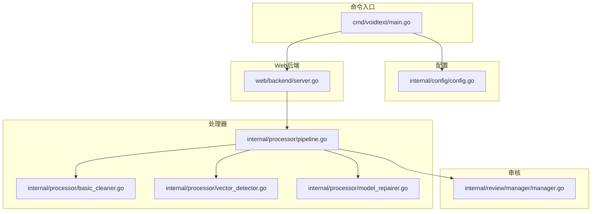
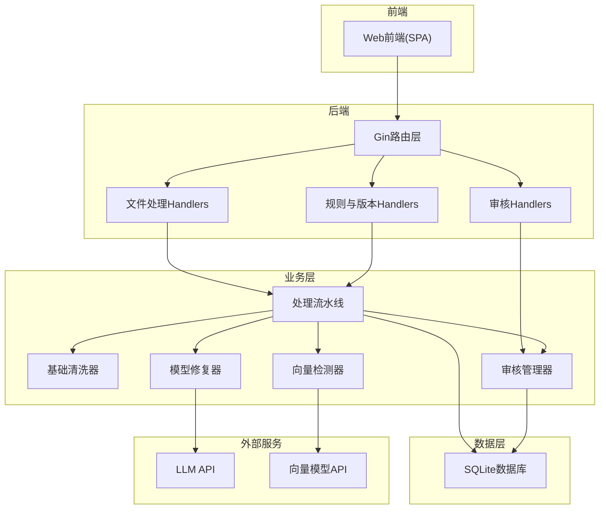
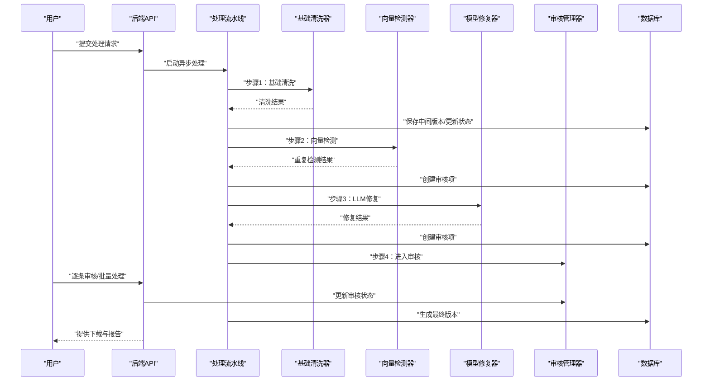
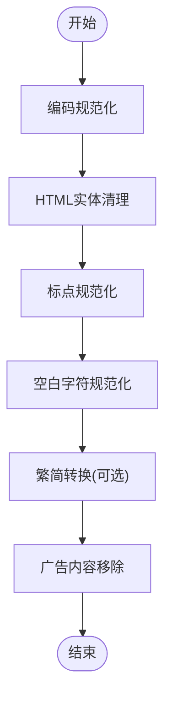
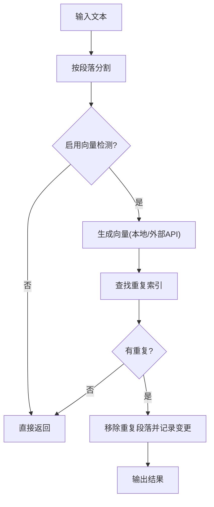
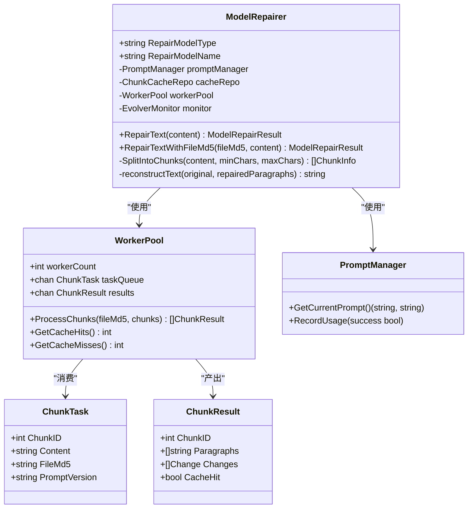
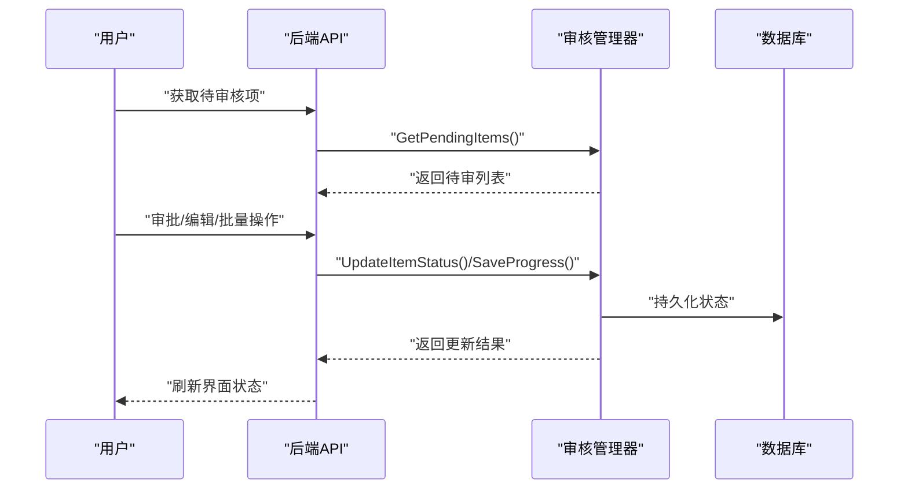
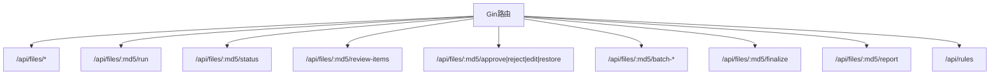
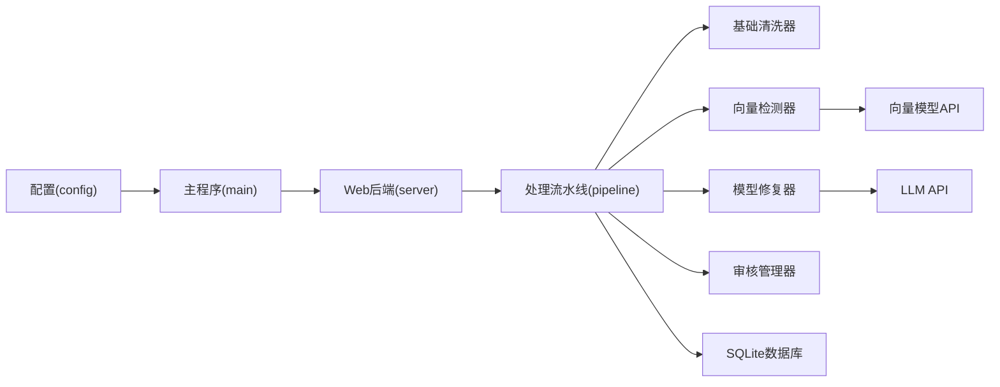

# 项目介绍

<cite>
**本文引用的文件**
- [cmd/voidtext/main.go](file://cmd/voidtext/main.go)
- [internal/config/config.go](file://internal/config/config.go)
- [internal/processor/pipeline.go](file://internal/processor/pipeline.go)
- [internal/processor/basic_cleaner.go](file://internal/processor/basic_cleaner.go)
- [internal/processor/vector_detector.go](file://internal/processor/vector_detector.go)
- [internal/processor/model_repairer.go](file://internal/processor/model_repairer.go)
- [internal/review/manager/manager.go](file://internal/review/manager/manager.go)
- [web/backend/server.go](file://web/backend/server.go)
- [doc/02-系统架构.md](file://doc/02-系统架构.md)
- [README.md](file://README.md)
</cite>

## 目录
1. [简介](#简介)
2. [项目结构](#项目结构)
3. [核心组件](#核心组件)
4. [架构总览](#架构总览)
5. [详细组件分析](#详细组件分析)
6. [依赖关系分析](#依赖关系分析)
7. [性能考量](#性能考量)
8. [故障排查指南](#故障排查指南)
9. [结论](#结论)
10. [附录](#附录)

## 简介
VoidText 是一个面向中文小说TXT文本的智能化清洗与修复系统，旨在帮助用户自动识别并修复文本中的错别字、格式问题、重复内容以及广告干扰等常见问题。项目采用“五步处理流水线”：基础清洗 → 向量检测 → LLM修复 → 人工审核 → 生成文件，并结合AI辅助修复、向量相似度检测、人工审核机制与版本链管理，形成一套完整的文本质量保障方案。

- 核心目标与使命
  - 自动化提升小说文本质量：通过规则与AI能力，减少人工校对成本，提高清洗效率与一致性。
  - 降低错别字与格式问题：利用错别字映射、标点规范化、段落结构优化等手段，改善阅读体验。
  - 智能去重与修复：基于向量相似度检测重复段落，结合LLM进行语义层面的错别字与语法修复。
  - 透明可控的审核流程：将AI建议转化为可审阅的修改项，支持逐条审批、编辑与批量处理，确保最终质量。

- 解决的实际问题
  - 错别字与语法错误：通过LLM修复与本地字典兜底，自动纠正常见错别字与语法问题。
  - 格式与排版问题：统一换行、标点、空白字符，规范化章节结构，提升可读性。
  - 重复内容：基于向量相似度检测重复段落，自动移除冗余内容。
  - 广告与无关内容：通过正则规则识别并移除广告、推广、来源声明等无关信息。

- 技术特色与创新点
  - AI辅助修复：支持外部LLM API与本地字典双重修复路径，具备缓存与重试机制，提升稳定性与性能。
  - 向量相似度检测：支持本地或外部API向量模型，进行段落级相似度计算与重复检测。
  - 人工审核机制：将AI修复建议转化为可审阅项，支持通过/拒绝/编辑/恢复/批量操作，保证最终质量。
  - 自进化监控：集成Evolver提示词优化系统，基于缓存命中率与API错误率等指标自动优化提示词。
  - 版本链管理：以MD5为唯一标识，维护原始文件与中间版本的父子关系，支持断点续传与进度恢复。

- 应用场景与目标用户
  - 场景：个人书库整理、小说平台内容治理、翻译与出版前校对、电子书制作与发布。
  - 用户：小说作者、书友会管理员、内容运营、出版社编辑、电子书制作者。

- 整体架构概览
  - 前后端分离：前端为单页应用，后端基于Go + Gin提供REST API，SQLite本地存储。
  - 处理流水线：五步处理流水线异步执行，支持进度轮询与断点续传。
  - 审核与报告：提供审核界面与处理报告，支持版本链追溯与导出。

**章节来源**
- [README.md:1-140](file://README.md#L1-L140)
- [doc/02-系统架构.md:1-205](file://doc/02-系统架构.md#L1-L205)

## 项目结构
项目采用模块化组织，主要分为命令入口、配置、处理器、数据库、审核、外部接口与Web后端等模块。前端静态资源位于web/frontend，后端通过Gin路由暴露REST API。

**图表来源**
- [cmd/voidtext/main.go:1-61](file://cmd/voidtext/main.go#L1-L61)
- [internal/config/config.go:1-204](file://internal/config/config.go#L1-L204)
- [internal/processor/pipeline.go:1-610](file://internal/processor/pipeline.go#L1-L610)
- [internal/processor/basic_cleaner.go:1-280](file://internal/processor/basic_cleaner.go#L1-L280)
- [internal/processor/vector_detector.go:1-224](file://internal/processor/vector_detector.go#L1-L224)
- [internal/processor/model_repairer.go:1-731](file://internal/processor/model_repairer.go#L1-L731)
- [internal/review/manager/manager.go:1-234](file://internal/review/manager/manager.go#L1-L234)
- [web/backend/server.go:1-58](file://web/backend/server.go#L1-L58)

**章节来源**
- [doc/02-系统架构.md:33-71](file://doc/02-系统架构.md#L33-L71)

## 核心组件
- 配置中心：负责加载.env配置、验证参数、创建必要的数据目录。
- 处理流水线：协调五步处理流程，记录进度与状态，支持断点续传。
- 基础清洗器：处理HTML实体、标点、空白字符、繁简转换与广告移除。
- 向量检测器：基于段落向量相似度检测重复内容，支持本地或外部API模型。
- 模型修复器：集成智能分块、Worker Pool并发、缓存幂等性与断点续传，支持提示词热重载与自进化监控。
- 审核管理器：将AI建议转化为可审阅项，支持状态流转与持久化。
- Web后端：提供文件上传、处理、审核、版本与报告等REST API。

**章节来源**
- [internal/config/config.go:14-122](file://internal/config/config.go#L14-L122)
- [internal/processor/pipeline.go:19-158](file://internal/processor/pipeline.go#L19-L158)
- [internal/processor/basic_cleaner.go:19-51](file://internal/processor/basic_cleaner.go#L19-L51)
- [internal/processor/vector_detector.go:12-69](file://internal/processor/vector_detector.go#L12-L69)
- [internal/processor/model_repairer.go:19-75](file://internal/processor/model_repairer.go#L19-L75)
- [internal/review/manager/manager.go:44-54](file://internal/review/manager/manager.go#L44-L54)
- [web/backend/server.go:10-57](file://web/backend/server.go#L10-L57)

## 架构总览
系统采用前后端分离架构，后端以Go + Gin为核心，通过REST API与前端交互；处理器模块负责文本清洗与修复；数据库模块以SQLite本地存储为主；外部模块对接LLM与向量模型API。

**图表来源**
- [doc/02-系统架构.md:3-31](file://doc/02-系统架构.md#L3-L31)
- [web/backend/server.go:28-54](file://web/backend/server.go#L28-L54)
- [internal/processor/pipeline.go:104-158](file://internal/processor/pipeline.go#L104-L158)
- [internal/processor/model_repairer.go:251-319](file://internal/processor/model_repairer.go#L251-L319)
- [internal/processor/vector_detector.go:200-223](file://internal/processor/vector_detector.go#L200-L223)

## 详细组件分析

### 处理流水线（五步流程）
处理流水线以步骤顺序推进，每步完成后更新状态与进度，并在必要时生成中间版本与审核项。

**图表来源**
- [internal/processor/pipeline.go:104-158](file://internal/processor/pipeline.go#L104-L158)
- [internal/processor/pipeline.go:160-271](file://internal/processor/pipeline.go#L160-L271)
- [internal/processor/pipeline.go:273-376](file://internal/processor/pipeline.go#L273-L376)
- [internal/processor/pipeline.go:436-522](file://internal/processor/pipeline.go#L436-L522)
- [internal/review/manager/manager.go:56-89](file://internal/review/manager/manager.go#L56-L89)

**章节来源**
- [internal/processor/pipeline.go:19-102](file://internal/processor/pipeline.go#L19-L102)
- [internal/processor/pipeline.go:160-271](file://internal/processor/pipeline.go#L160-L271)
- [internal/processor/pipeline.go:273-376](file://internal/processor/pipeline.go#L273-L376)
- [internal/processor/pipeline.go:436-522](file://internal/processor/pipeline.go#L436-L522)

### 基础清洗器（错别字、格式、广告）
基础清洗器负责编码规范化、HTML实体清理、标点与空白字符规范化、繁简转换与广告移除，为后续步骤提供高质量输入。

**图表来源**
- [internal/processor/basic_cleaner.go:31-51](file://internal/processor/basic_cleaner.go#L31-L51)
- [internal/processor/basic_cleaner.go:53-190](file://internal/processor/basic_cleaner.go#L53-L190)
- [internal/processor/basic_cleaner.go:192-232](file://internal/processor/basic_cleaner.go#L192-L232)
- [internal/processor/basic_cleaner.go:234-270](file://internal/processor/basic_cleaner.go#L234-L270)

**章节来源**
- [internal/processor/basic_cleaner.go:19-280](file://internal/processor/basic_cleaner.go#L19-L280)

### 向量检测器（重复内容检测）
向量检测器将文本按段落切分，生成向量表示（本地或外部API），计算相似度并移除重复段落，同时记录变更供审核。

**图表来源**
- [internal/processor/vector_detector.go:36-69](file://internal/processor/vector_detector.go#L36-L69)
- [internal/processor/vector_detector.go:88-111](file://internal/processor/vector_detector.go#L88-L111)
- [internal/processor/vector_detector.go:113-130](file://internal/processor/vector_detector.go#L113-L130)
- [internal/processor/vector_detector.go:145-175](file://internal/processor/vector_detector.go#L145-L175)
- [internal/processor/vector_detector.go:200-223](file://internal/processor/vector_detector.go#L200-L223)

**章节来源**
- [internal/processor/vector_detector.go:12-224](file://internal/processor/vector_detector.go#L12-L224)

### 模型修复器（AI辅助修复）
模型修复器支持智能分块、Worker Pool并发、缓存幂等性与断点续传，结合提示词热重载与自进化监控，提升修复质量与稳定性。

**图表来源**
- [internal/processor/model_repairer.go:19-75](file://internal/processor/model_repairer.go#L19-L75)
- [internal/processor/model_repairer.go:526-563](file://internal/processor/model_repairer.go#L526-L563)
- [internal/processor/model_repairer.go:539-545](file://internal/processor/model_repairer.go#L539-L545)
- [internal/processor/model_repairer.go:547-563](file://internal/processor/model_repairer.go#L547-L563)

**章节来源**
- [internal/processor/model_repairer.go:19-731](file://internal/processor/model_repairer.go#L19-L731)

### 审核管理器（人工审核）
审核管理器将AI建议转化为可审阅项，支持状态流转（待审/通过/拒绝/跳过）、备注与持久化，确保最终质量可控。

**图表来源**
- [internal/review/manager/manager.go:159-176](file://internal/review/manager/manager.go#L159-L176)
- [internal/review/manager/manager.go:111-142](file://internal/review/manager/manager.go#L111-L142)
- [internal/review/manager/manager.go:197-214](file://internal/review/manager/manager.go#L197-L214)

**章节来源**
- [internal/review/manager/manager.go:44-234](file://internal/review/manager/manager.go#L44-L234)

### Web后端（REST API）
Web后端提供文件上传、处理、规则配置、审核与报告等API，前端通过轮询获取进度与状态。

**图表来源**
- [web/backend/server.go:28-54](file://web/backend/server.go#L28-L54)

**章节来源**
- [web/backend/server.go:10-58](file://web/backend/server.go#L10-L58)

## 依赖关系分析
- 配置加载：应用启动时加载.env配置，初始化数据目录与端口等参数。
- 处理流水线：依赖基础清洗器、向量检测器、模型修复器与审核管理器，协调步骤执行与状态更新。
- 数据持久化：通过SQLite存储文件记录、版本链、审核项与处理日志。
- 外部服务：LLM API与向量模型API可选，支持本地降级与热重载。

**图表来源**
- [cmd/voidtext/main.go:18-26](file://cmd/voidtext/main.go#L18-L26)
- [internal/config/config.go:48-122](file://internal/config/config.go#L48-L122)
- [internal/processor/pipeline.go:104-158](file://internal/processor/pipeline.go#L104-L158)
- [internal/processor/model_repairer.go:251-319](file://internal/processor/model_repairer.go#L251-L319)
- [internal/processor/vector_detector.go:200-223](file://internal/processor/vector_detector.go#L200-L223)

**章节来源**
- [internal/config/config.go:48-122](file://internal/config/config.go#L48-L122)
- [internal/processor/pipeline.go:104-158](file://internal/processor/pipeline.go#L104-L158)

## 性能考量
- 分块与并发：模型修复器将文本智能分块（1500-2000字符），通过Worker Pool并发处理，显著提升吞吐量。
- 缓存与幂等：块级缓存避免重复调用LLM，统计命中率与未命中数，支持断点续传与重试队列。
- 异步处理：处理流程异步执行，避免HTTP超时，支持断点续传与进度恢复。
- 本地降级：当外部API不可用时，自动降级为本地字典修复，保证系统可用性。
- 监控与优化：自进化监控根据缓存命中率与API错误率触发Evolver优化，持续改进提示词效果。

**章节来源**
- [internal/processor/model_repairer.go:96-122](file://internal/processor/model_repairer.go#L96-L122)
- [internal/processor/model_repairer.go:251-319](file://internal/processor/model_repairer.go#L251-L319)
- [internal/processor/pipeline.go:378-434](file://internal/processor/pipeline.go#L378-L434)
- [doc/02-系统架构.md:187-205](file://doc/02-系统架构.md#L187-L205)

## 故障排查指南
- 文件上传失败
  - 检查文件大小是否超过限制，默认100MB。
  - 检查文件类型是否为txt。
  - 检查网络连接是否正常。
- 处理速度慢
  - LLM修复阶段耗时较长，属于正常现象。
  - 可关闭浏览器，处理在后台继续。
  - 可设置开关跳过LLM修复以加速流程。
- 外部API调用失败
  - 检查API URL与API Key是否正确。
  - 检查网络连接是否正常。
  - 模型修复阶段会自动降级为本地字典修复。
- 审核项未出现
  - 确认向量检测与LLM修复是否产生变更。
  - 检查审核状态是否为“待审”，可通过轮询接口刷新。
- 版本链异常
  - 确认文件MD5一致且版本链parent_md5正确关联。
  - 检查数据库记录与中间文件路径是否匹配。

**章节来源**
- [README.md:108-127](file://README.md#L108-L127)
- [internal/processor/pipeline.go:436-468](file://internal/processor/pipeline.go#L436-L468)

## 结论
VoidText通过“规则+AI”的组合，实现了小说文本的自动化清洗与修复，兼顾效率与质量。其异步处理、版本链管理、人工审核与自进化监控等特性，使其在个人书库整理、内容平台治理与出版前校对等场景中具有广泛的应用价值。未来可进一步扩展向量模型能力与提示词优化策略，持续提升修复精度与用户体验。

[本节不涉及具体文件分析，无需列出章节来源]

## 附录
- 快速开始
  - 克隆项目、配置.env、编译并运行服务，访问http://localhost:8080。
- 使用指南
  - 上传文件、配置规则、开始处理、逐条审核、生成最终文件与报告。
- 常见问题
  - 文件上传失败、处理速度慢、外部API调用失败等常见问题的排查方法。

**章节来源**
- [README.md:26-107](file://README.md#L26-L107)