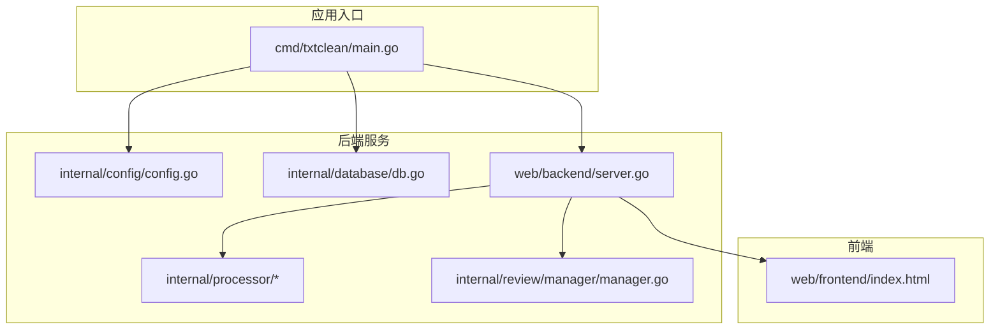
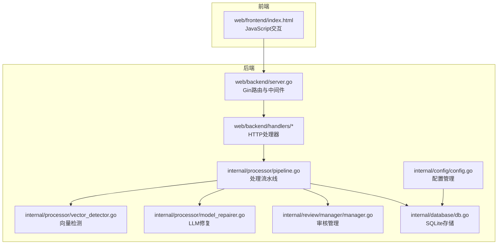
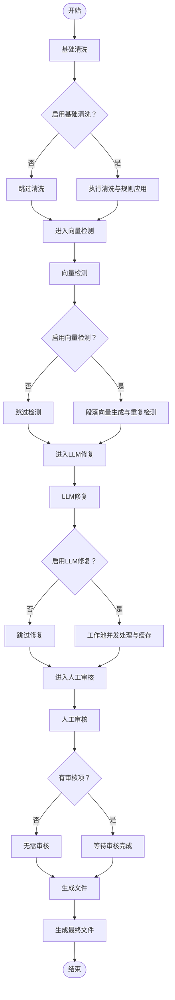
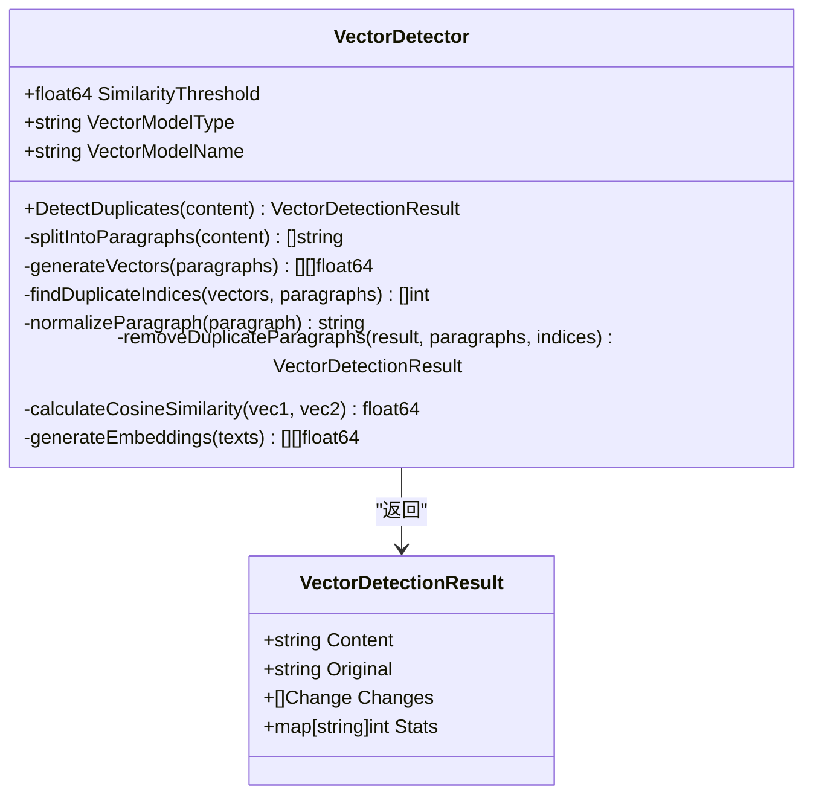
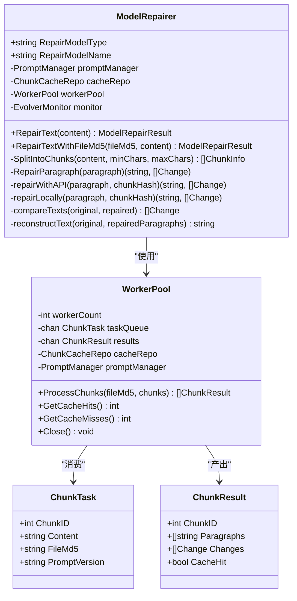
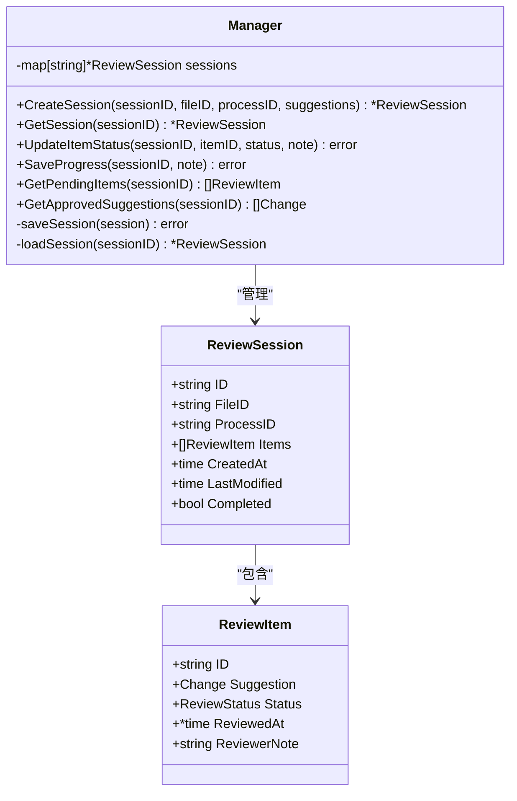
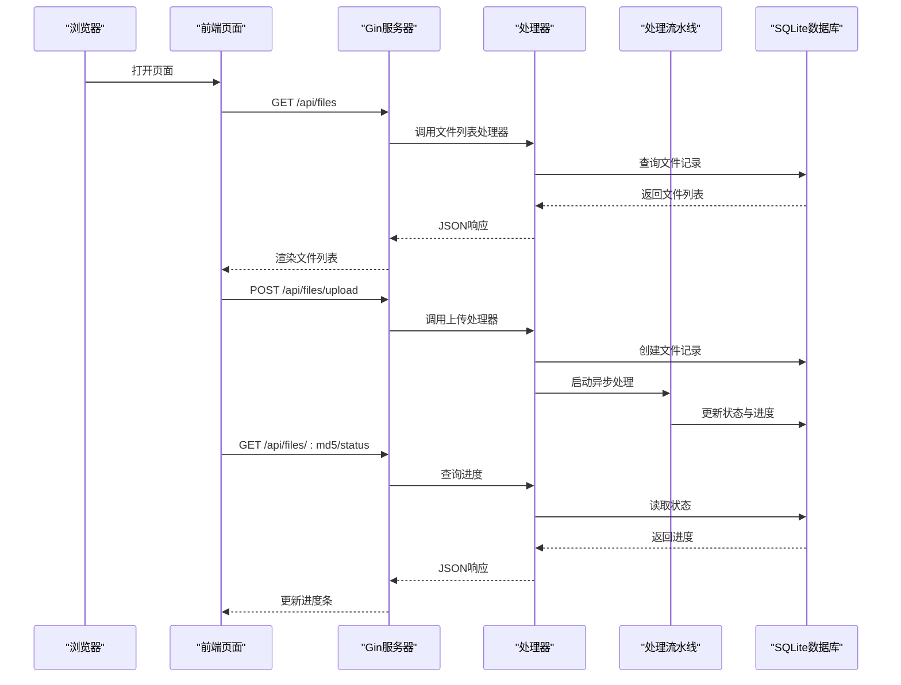
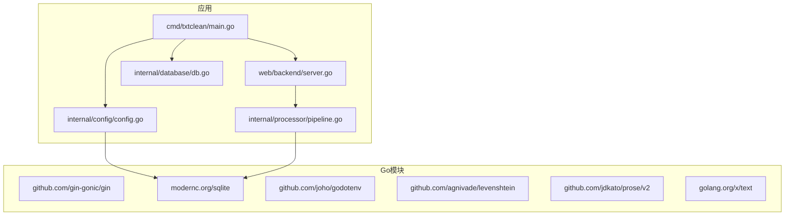

# 项目概述

<cite>
**本文档引用的文件**
- [main.go](file://cmd/txtclean/main.go)
- [pipeline.go](file://internal/processor/pipeline.go)
- [vector_detector.go](file://internal/processor/vector_detector.go)
- [model_repairer.go](file://internal/processor/model_repairer.go)
- [manager.go](file://internal/review/manager/manager.go)
- [server.go](file://web/backend/server.go)
- [config.go](file://internal/config/config.go)
- [db.go](file://internal/database/db.go)
- [index.html](file://web/frontend/index.html)
- [README.md](file://README.md)
- [02-系统架构.md](file://doc/02-系统架构.md)
- [run.sh](file://scripts/run.sh)
- [sample.txt](file://testing/smoking_testing/test_data/sample.txt)
</cite>

## 目录
1. [简介](#简介)
2. [项目结构](#项目结构)
3. [核心组件](#核心组件)
4. [架构总览](#架构总览)
5. [详细组件分析](#详细组件分析)
6. [依赖关系分析](#依赖关系分析)
7. [性能考虑](#性能考虑)
8. [故障排除指南](#故障排除指南)
9. [结论](#结论)
10. [附录](#附录)

## 简介
txtCleaning是一个基于Go语言开发的全栈文本处理系统，专注于小说文本的清洗与智能修复。该项目采用前后端分离架构，提供从文件上传、规则配置、自动化清洗、向量相似度检测、LLM智能修复、人工审核到版本管理的完整工作流。系统通过五步处理流水线实现高效、可控且可追溯的文本处理过程，并支持断点续传、缓存幂等性和自进化监控等高级特性。

## 项目结构
项目采用模块化的Go包结构，结合前端静态资源与后端API服务：
- cmd/txtclean：应用入口，负责配置加载、数据库初始化与HTTP服务器启动
- internal/*：核心业务逻辑模块
  - config：配置管理与环境变量加载
  - database：SQLite数据库初始化与表结构管理
  - file：文件MD5计算、版本管理辅助
  - processor：文本处理流水线与算法实现
  - review/manager：人工审核状态管理
  - external：外部API调用封装
  - logging：日志记录
  - processor/preprocess/postprocess：预处理与后处理
  - processor/rules：规则管理
  - processor/model：NLP模型封装
- web/backend：基于Gin的REST API服务
- web/frontend：静态前端页面与JavaScript交互
- scripts：构建与部署脚本
- testing：冒烟测试与单元测试
- doc：项目文档

**图表来源**
- [main.go:1-61](file://cmd/txtclean/main.go#L1-L61)
- [config.go:1-204](file://internal/config/config.go#L1-L204)
- [db.go:1-223](file://internal/database/db.go#L1-L223)
- [server.go:1-58](file://web/backend/server.go#L1-L58)

**章节来源**
- [README.md:1-140](file://README.md#L1-L140)
- [02-系统架构.md:1-205](file://doc/02-系统架构.md#L1-L205)

## 核心组件
- 文本处理流水线：五步处理流程（基础清洗、向量检测、LLM修复、人工审核、生成文件），支持进度计算与断点续传
- 向量相似度检测：基于段落向量的重复检测与移除，支持本地与外部API两种模式
- LLM智能修复：集成工作池并发、缓存幂等性、动态提示词管理与自进化监控
- 人工审核机制：支持逐条审核、批量操作、状态跟踪与版本回溯
- 版本管理系统：基于MD5的文件唯一标识与版本链追溯，支持中间版本保存与最终文件生成
- 配置与数据库：统一配置管理、SQLite本地存储与索引优化

**章节来源**
- [pipeline.go:1-610](file://internal/processor/pipeline.go#L1-L610)
- [vector_detector.go:1-224](file://internal/processor/vector_detector.go#L1-L224)
- [model_repairer.go:1-731](file://internal/processor/model_repairer.go#L1-L731)
- [manager.go:1-234](file://internal/review/manager/manager.go#L1-L234)
- [db.go:1-223](file://internal/database/db.go#L1-L223)

## 架构总览
系统采用前后端分离架构，后端基于Go与Gin提供REST API，前端为单页应用（SPA）。数据持久化使用SQLite，支持异步处理与进度轮询，确保用户体验与处理效率。

**图表来源**
- [server.go:1-58](file://web/backend/server.go#L1-L58)
- [pipeline.go:1-610](file://internal/processor/pipeline.go#L1-L610)
- [vector_detector.go:1-224](file://internal/processor/vector_detector.go#L1-L224)
- [model_repairer.go:1-731](file://internal/processor/model_repairer.go#L1-L731)
- [manager.go:1-234](file://internal/review/manager/manager.go#L1-L234)
- [config.go:1-204](file://internal/config/config.go#L1-L204)
- [db.go:1-223](file://internal/database/db.go#L1-L223)

## 详细组件分析

### 文本处理流水线
流水线定义了五个处理步骤：基础清洗、向量检测、LLM修复、人工审核、生成文件。每个步骤都有明确的状态推进与进度计算逻辑，并支持跳过与断点续传。

**图表来源**
- [pipeline.go:104-522](file://internal/processor/pipeline.go#L104-L522)

**章节来源**
- [pipeline.go:1-610](file://internal/processor/pipeline.go#L1-L610)

### 向量相似度检测
向量检测器支持本地与外部API两种模式，通过段落规范化与向量生成实现重复内容检测与移除，并将变更记录到审核项中。

**图表来源**
- [vector_detector.go:12-224](file://internal/processor/vector_detector.go#L12-L224)

**章节来源**
- [vector_detector.go:1-224](file://internal/processor/vector_detector.go#L1-L224)

### LLM智能修复（重构版）
模型修复器集成智能分块、工作池并发、缓存幂等性与动态提示词管理，支持断点续传与自进化监控。

**图表来源**
- [model_repairer.go:19-731](file://internal/processor/model_repairer.go#L19-L731)

**章节来源**
- [model_repairer.go:1-731](file://internal/processor/model_repairer.go#L1-L731)

### 人工审核机制
审核管理器提供会话创建、状态更新、进度保存与持久化能力，支持内存与磁盘双重存储，确保会话的可靠性与可恢复性。

**图表来源**
- [manager.go:44-234](file://internal/review/manager/manager.go#L44-L234)

**章节来源**
- [manager.go:1-234](file://internal/review/manager/manager.go#L1-L234)

### API与前端交互
后端通过Gin提供REST API，前端通过JavaScript实现SPA交互，支持文件上传、规则配置、进度轮询与审核操作。

**图表来源**
- [server.go:28-54](file://web/backend/server.go#L28-L54)
- [pipeline.go:104-158](file://internal/processor/pipeline.go#L104-L158)
- [db.go:89-222](file://internal/database/db.go#L89-L222)

**章节来源**
- [server.go:1-58](file://web/backend/server.go#L1-L58)
- [index.html:1-230](file://web/frontend/index.html#L1-L230)

## 依赖关系分析
项目的技术栈选择体现了对性能、易用性与可维护性的平衡：
- Go语言：高性能、并发友好、跨平台编译
- Gin框架：轻量级Web框架，适合REST API开发
- SQLite：单文件数据库，无需独立部署，适合个人使用场景
- 前端技术：HTML/CSS/JavaScript，简单直观的SPA实现

**图表来源**
- [go.mod:1-54](file://go.mod#L1-L54)
- [main.go:1-61](file://cmd/txtclean/main.go#L1-L61)
- [server.go:1-58](file://web/backend/server.go#L1-L58)
- [config.go:1-204](file://internal/config/config.go#L1-L204)
- [db.go:1-223](file://internal/database/db.go#L1-L223)
- [pipeline.go:1-610](file://internal/processor/pipeline.go#L1-L610)

**章节来源**
- [go.mod:1-54](file://go.mod#L1-L54)

## 性能考虑
- SQLite并发优化：启用WAL模式、设置同步模式与缓存大小，配合单写连接确保写入顺序执行
- LLM修复并发：工作池并发处理Chunk，缓存命中减少API调用，降低延迟
- 分块策略：智能分块避免API token限制，提升处理吞吐量
- 断点续传：中间版本保存与状态恢复，支持长时间任务的可靠执行

## 故障排除指南
- 配置加载失败：检查.env文件路径与权限，确认环境变量正确设置
- 数据库连接异常：验证DATA_DIR目录可写，SQLite驱动兼容性
- LLM API调用失败：检查API URL与密钥，确认网络连通性，系统会自动降级为本地修复
- 处理进度停滞：检查异步处理goroutine状态，确认数据库写入正常

**章节来源**
- [config.go:48-122](file://internal/config/config.go#L48-L122)
- [db.go:15-87](file://internal/database/db.go#L15-L87)
- [model_repairer.go:251-319](file://internal/processor/model_repairer.go#L251-L319)

## 结论
txtCleaning项目通过模块化设计与清晰的处理流水线，实现了小说文本清洗与智能修复的完整解决方案。其技术栈选择兼顾性能与易用性，前端与后端协作流畅，支持异步处理与版本追溯，适合个人与小型团队使用。未来可进一步扩展规则引擎、增强审核体验与优化LLM调用成本。

## 附录

### 快速开始指南
- 环境要求：Go 1.21+，SQLite（内置驱动），可选外部LLM API
- 安装步骤：
  1) 克隆项目并进入目录
  2) 复制模板配置并编辑.env文件
  3) 编译项目（支持Linux/macOS与ARM64）
  4) 运行服务或使用启动脚本
- 基本使用：
  1) 访问 http://localhost:8080
  2) 上传TXT文件，配置规则后开始处理
  3) 查看进度，进入审核界面逐条审核
  4) 完成审核后生成最终文件并下载

**章节来源**
- [README.md:18-106](file://README.md#L18-L106)
- [run.sh:1-14](file://scripts/run.sh#L1-L14)

### 示例数据
测试样例文件包含常见的错别字与广告内容，可用于验证清洗效果。

**章节来源**
- [sample.txt:1-12](file://testing/smoking_testing/test_data/sample.txt#L1-L12)